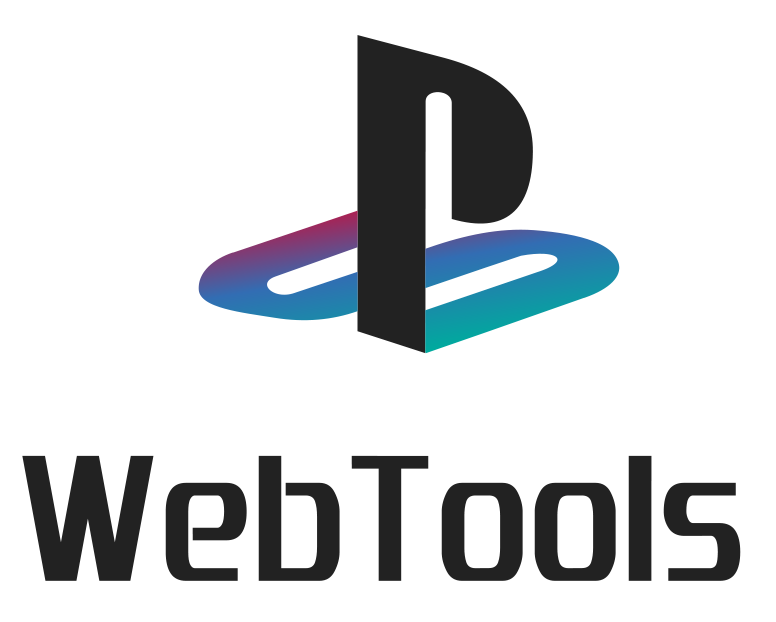

    <picture>
    <source media="(prefers-color-scheme: dark)" srcset="./.github/assets/logo-dark.png">
    <source media="(prefers-color-scheme: light)" srcset="./.github/assets/logo-light.png">
    
    </picture>

PSX WebTools is a collection of web-based utilities for PlayStation 1 (PSX) development and homebrew. This project aims to provide easy-to-use, browser-based tools for various PS1-related tasks.

The app shares the serial port across all tools, supporting the following baud rates:

- 115,200 bps (Standard)
- 510,000 bps (FTDI friendly)
- 518,400 bps (PSX native)
- 1,036,800 bps (SIOLOADER)

## Current Tools

### 1. EXE Loader

The EXE Loader is a web-based tool inspired by the [sioload.py](https://github.com/danhans42/sioload) script. It allows you to upload and execute PSX-EXE files on a PlayStation 1 console using the serial port.

## Getting Started

### Prerequisites

- A modern web browser with Web Serial API support (Chrome, Edge, Opera)
- A PlayStation 1 console with a serial port
- A compatible USB-to-Serial adapter (FTDI, CH340, or CP2103 recommended)

### Usage

1. Visit the PSX WebTools website (URL to be added)
2. Connect your PlayStation 1 to your computer using the serial cable
3. Click the "Connect" button and select the appropriate serial port
4. Choose the desired baud rate from the dropdown menu
5. Select the PSX-EXE file you want to upload
6. Click "Upload and Execute" to send the file to your PlayStation 1
7. Monitor the progress and logs in the application interface

## Development

This project is built using React, Vite, and TypeScript. To set up the development environment:

1. Clone this repository
2. Run `npm install` to install dependencies
3. Use `npm run dev` to start the development server

## License

This project is licensed under the GNU General Public License v3.0. See the [LICENSE](LICENSE) file for details.

## Contributing

Contributions are welcome! Please feel free to submit a Pull Request.
